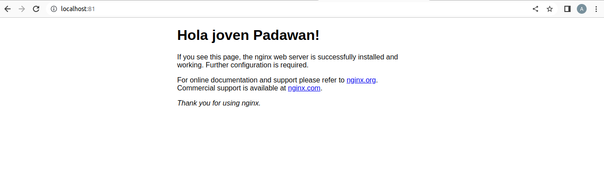

# Práctica 2 Docker
## Parte 1
Primero, creamos un volumen con:

    sudo docker volume create volumenDocker
Después, creamos el primer contenedor con:

    sudo docker run --name contenedorNginx -d -p 80:80 --mount type=volume,source=volumenDocker,target=/usr/share/nginx/html nginx
Después, entramos en el contenedor con:

    sudo docker exec -it contenedorNginx /bin/bash
Una vez dentro, ejecutamos:

    apt update
    apt install nano
    cd usr/share/nginx/html
    nano index.html
Y cambiamos el código de la página web. Luego, creamos otro contenedor con:

    sudo docker run --name contenedorNginx2 -d -p 81:80 --mount type=volume,source=volumenDocker,target=/usr/share/nginx/html nginx
Y la página que obtenemos al acceder a localhost:80 y localhost:81 es la misma:

