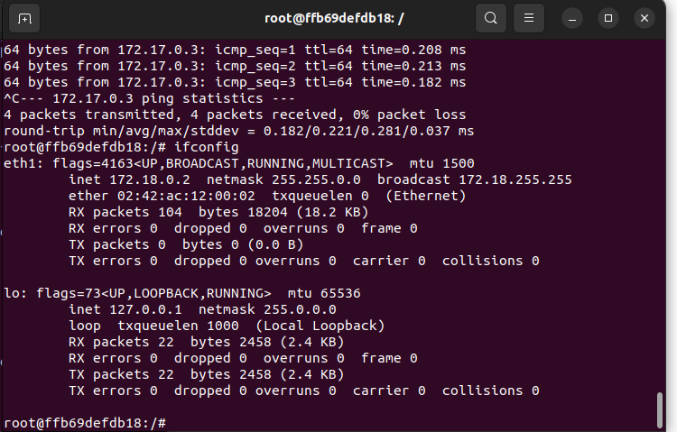
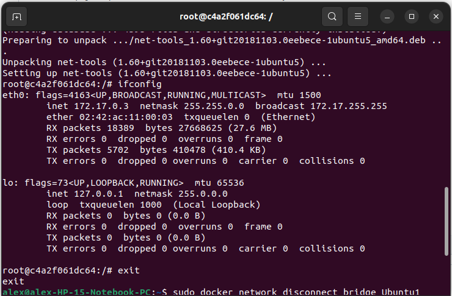

# Práctica 2 Docker
## Parte 1
Primero, creamos un volumen con:

    sudo docker volume create volumenDocker
Después, creamos el primer contenedor con:

    sudo docker run --name contenedorNginx -d -p 80:80 --mount type=volume,source=volumenDocker,target=/usr/share/nginx/html nginx
Después, entramos en el contenedor con:

    sudo docker exec -it contenedorNginx /bin/bash
Una vez dentro, ejecutamos:

    apt update
    apt install nano
    cd usr/share/nginx/html
    nano index.html
Y cambiamos el código de la página web. Luego, creamos otro contenedor con:

    sudo docker run --name contenedorNginx2 -d -p 81:80 --mount type=volume,source=volumenDocker,target=/usr/share/nginx/html nginx
Y la página que obtenemos al acceder a localhost:80 y localhost:81 es la misma:

## Parte 2
Primero, creamos la red con:

    sudo docker network create redDocker
Y luego los contenedores:

    sudo docker run --name Ubuntu1 -dt --network redDocker ubuntu /bin/bash
    sudo docker run --name Ubuntu2 -dt ubuntu /bin/bash
Entramos en los contenedores con:

    sudo docker exec -ti Ubuntu1 /bin/bash
    sudo docker exec -ti Ubuntu2 /bin/bash
Y dentro de cada uno instalamos con:

    apt install net-tools inetutils-ping
Vemos las ip de los contenedores con ifconfig, y tenemos:

Que son las direcciones IP de Ubuntu1 y Ubuntu2, respectivamente. Vemos como Ubuntu1 tiene una IP 172.18.x (redDocker) y Ubunutu2 una 172.17.x (red bridge, por defecto). Como las direcciones no son de la misma red, no funcionará el ping.

Añadimos Ubuntu a redDocker con:

    sudo docker network connect redDocker Ubuntu2
Y una vez hecho el cambio, Ubuntu2 adquiere la IP 172.18.0.3, correspondiente a redDocker. Ambos contenedores pueden hacerse ping entre sí usando las IPs de la red 172.18.0.0 correspondientes a cada uno.
