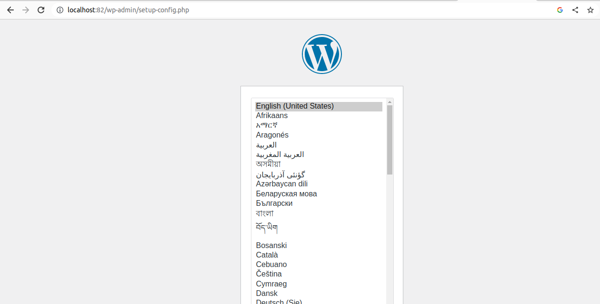

# Ejercicio Práctica 3 Docker
## Parte 1
Es un archivo muy simple. Declaramos los servicios `drupal` y `mysql`, con las imágenes `drupal` y `mysql`, y el nombre de contenedores que deseemos.
Además, para drupal configuramos el parámetro `ports` con el puerto 81 que se ha pedido. Por último, configuramos el volumen de cada servicio a la ruta 
absoluta deseada, y lo declaramos al final del fichero también. Ejecutamos:

    sudo docker compose up -d
Y vemos que funciona correctamente.

## Parte 2
El archivo es prácticamente igual que en la parte anterior. Lo único que cambia es el nombre de los servicios, imágenes y contenedores, y que esta vez
declaramos `networks` en vez de `volumes`, y con el nombre `redDocker`. Evidentemente, al ser una red y un volumen no hay que especificar ninguna ruta.
Lanzamos los contenedores con

    sudo docker compose up -d
Y vemos que funciona correctamente:

## Archivos
Los archivos correspondientes a esta práctica se pueden encontrar [aquí](docker_3).
